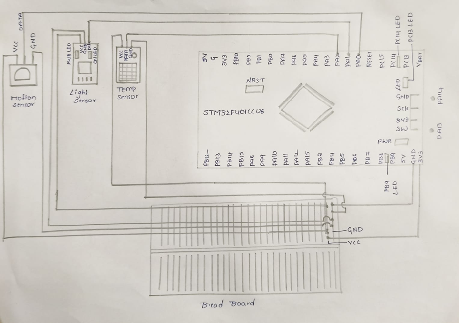

# Smart-Home-System

## 📝 Overview
This project implements a Smart Home System using the STM32F4 microcontroller, integrating motion, light, and temperature sensors. The system responds to environmental changes by activating LEDs to indicate conditions like motion detection, light presence, or temperature threshold breach. Ideal for basic home automation and environment-aware security setups.

---

## ✨ Features

- Detects motion using a PIR sensor  
- Monitors ambient light levels  
- Measures temperature using a DHT11 sensor  
- LED indicators:
  - Onboard LED for motion detection  
  - External LED for light + motion  
  - Temperature LED blinks when threshold (> 27.3°C) is exceeded  

---

## 🧾 Required Components

| Component                       | Purpose                                                |
|--------------------------------|--------------------------------------------------------|
| STM32F4xx Microcontroller       | Sensor interfacing and control logic (ARM Cortex-M4)   |
| PIR Motion Sensor               | Detects motion based on infrared heat                  |
| HC-SR04 Ultrasonic Sensor       | (Optional) Distance detection                          |
| LDR (Light Dependent Resistor) | Detects ambient light with voltage divider             |
| DHT11 Temperature Sensor        | Monitors environmental temperature                     |
| Push Button                     | User-triggered events or resets                        |
| 3 LEDs (Onboard + External)     | Visual status indicators                               |
| Resistors & Breadboard          | Pull-downs and prototyping                             |
| Jumper Wires                    | Component connectivity                                 |

---

## 📌 Pin Configuration

| STM32 Pin | Connected Device         | Direction   | Description                                      |
|-----------|--------------------------|-------------|--------------------------------------------------|
| PA0       | PIR Motion Sensor        | Input       | HIGH when motion is detected                     |
| PA1       | LDR (Light Sensor)       | Input       | Analog voltage based on light level              |
| PA2       | DHT11 Temp Sensor        | Input/Output| Communicates via 1-wire protocol                 |
| PB9       | External LED             | Output      | Lights up when motion + dark detected            |
| PC13      | Onboard LED              | Output (LOW)| Active LOW; turns ON when motion detected        |
| PC14      | Temp Alert LED           | Output      | Blinks when temperature exceeds threshold (27.3°C)|

---

## ⚙️ How It Works

### 🔍 1. Motion Sensor (PIR on PA0)
- **Motion detected:** Onboard LED at PC13 turns ON (active LOW).
- **No motion:** PC13 LED turns OFF.

### 💡 2. Light Sensor (LDR on PA1)
- **Dark + Motion:** External LED on PB9 blinks.
- **Dark + No Motion OR Bright Room:** PB9 remains OFF.

### 🌡️ 3. Temperature Sensor (DHT11 on PA2)
- **Temp > 27.3°C:** PC14 LED blinks.
- **Temp ≤ 27.3°C:** PC14 LED OFF.

---

## 🖼️ Circuit Diagram

---

## 📚 Learning Outcomes

- Hands-on with embedded system programming
- GPIO management and real-world sensor interfacing
- Real-time data-driven decision-making in microcontrollers

---

This project is licensed under the MIT License. See the LICENSE file for details.
